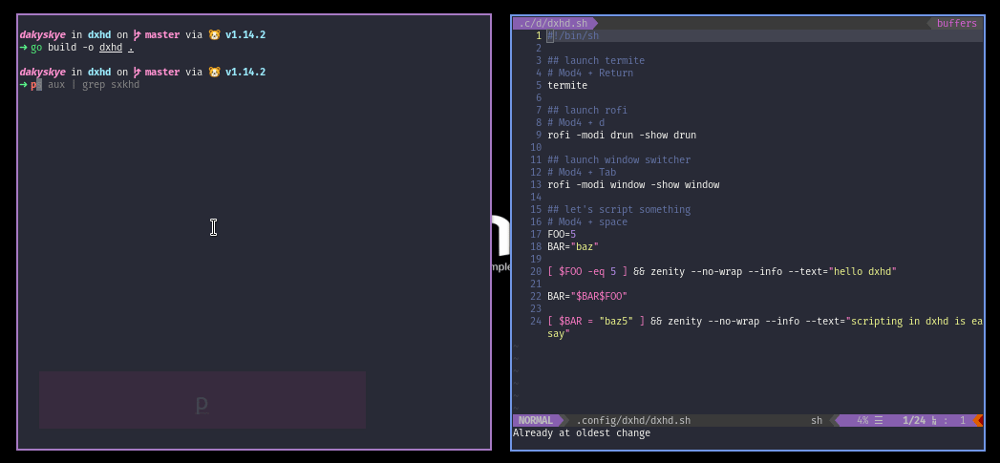

# dxhd

## daky's X11 hotkey daemon

This hotkey daemon is quite stable already and can be used *in production*, however, it's still WIP as it lacks some good features, like ranges and key release event support.

### Testing

* git clone the repo
* install Go programming language
* run `go build -o dxhd .`
* execute `./dxhd`

### Demo

### Roadmap

* [x] basic keybindings
* [ ] released keybindings ([#4](https://github.com/dakyskye/dxhd/issues/4))
* [ ] ranges ([#5](https://github.com/dakyskye/dxhd/issues/5))
* [ ] formatting ([#6](https://github.com/dakyskye/dxhd/issues/6))
* [ ] daemonisation ([#3](https://github.com/dakyskye/dxhd/issues/3))

## License

Licensed under the [**MIT**](https://choosealicense.com/licenses/mit/) license.
